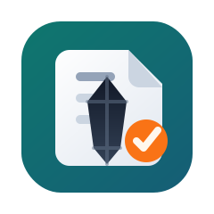

<p align="center">
  
</p>

<h1 align="center">@mtharrison/obsidian-capture</h1>

<p align="center">
  A lightweight webhook server that captures tasks and thoughts into your Obsidian daily notes via <a href="https://github.com/obsidianmd/obsidian-headless">obsidian-headless</a>.
</p>

<p align="center">
  Run it locally, in Docker, or on a hosted container platform. Fly.io is one option, not a requirement.
</p>

**How it works:** POST a thought -> server writes to today's daily note under the configured capture section (default: `## Captured`) -> `obsidian-headless` syncs the vault -> all your devices get the update.

## Quick Start

### 1. Install dependencies

```bash
npm install
```

### 2. Create `.env`

Copy the example file and edit it for your machine:

```bash
cp .env.example .env
```

Required:

- `API_KEY`: bearer token required for `POST /capture`
- `VAULT_PATH`: path to the local working copy of the Obsidian vault
- `DAILY_NOTE_PATH_TEMPLATE`: relative path and filename template inside the vault

Optional:

- `PORT`: HTTP port for the webhook server. Defaults to `8080`
- `TZ`: timezone used by Node's local date functions. Set this if you do not want the host default timezone
- `DAILY_NOTE_TITLE_TEMPLATE`: markdown title used if the daily note does not exist yet
- `CAPTURE_SECTION_HEADING`: section name used for captured entries

Template tokens available in `DAILY_NOTE_PATH_TEMPLATE` and `DAILY_NOTE_TITLE_TEMPLATE`:

- `{{YYYY}}`
- `{{MM}}`
- `{{DD}}`
- `{{DAY_NAME}}`
- `{{ISO_WEEK}}`

### 3. Start the server

```bash
npm start
```

### 4. Set up `obsidian-headless` (one-time)

From the project directory:

```bash
npx ob login
npx ob sync-list-remote
```

Then point the sync commands at the vault directory you configured in `VAULT_PATH`:

```bash
cd /absolute/path/to/your/vault
npx --prefix /absolute/path/to/this/project ob sync-setup --vault "YOUR_VAULT_NAME"
npx --prefix /absolute/path/to/this/project ob sync

find . -maxdepth 3 -type f | head
```

`YOUR_VAULT_NAME` should match one of the remote vault names shown by `npx ob sync-list-remote`.

### 5. Verify locally

```bash
# Health check
curl http://localhost:8080/health

# Test capture
curl -X POST http://localhost:8080/capture \
  -H "Content-Type: application/json" \
  -H "Authorization: Bearer YOUR_API_KEY" \
  -d '{"text": "Test capture from terminal"}'
```

If you deploy this somewhere else, replace `http://localhost:8080` with your public base URL such as `https://capture.example.com`.

## Deployment

This service only needs Node.js, a writable vault path, and persistent storage for your Obsidian sync state. You can run it:

- directly on a machine with Node.js
- in Docker with volumes mounted for the vault and config directories
- on a hosted container platform such as Fly.io

The repo includes [Dockerfile](/Users/matt/Developer/obsidian-capture/Dockerfile) and [fly.toml](/Users/matt/Developer/obsidian-capture/fly.toml) if you want a container-based deployment.

### Fly.io example (optional)

If you do want to use Fly.io, treat it as one deployment target rather than the default:

```bash
fly apps create your-capture-app
fly volumes create vault_data --region lhr --size 1
fly secrets set API_KEY="$(openssl rand -hex 32)"
fly secrets set TZ="Europe/London"
fly deploy
```

After deploy, open a shell in the running machine, then run the same `obsidian-headless` setup flow using the container paths:

```bash
cd /app
npx ob login
npx ob sync-list-remote
cd /data/vault
npx --prefix /app ob sync-setup --vault "YOUR_VAULT_NAME"
npx --prefix /app ob sync
```

---

## Client Setup

Use your actual capture endpoint in these examples:

```text
https://your-capture-host.example.com/capture
```

### Apple Shortcut (iPhone, Apple Watch, Mac)

Create a new Shortcut called **"Capture to Obsidian"**:

1. **Ask for Input** — Prompt: `Capture:`, Input Type: Text
2. **Get Contents of URL**
   - URL: `https://your-capture-host.example.com/capture`
   - Method: POST
   - Headers: `Authorization` = `Bearer YOUR_API_KEY`
   - Request Body: JSON — key `text`, value: *Provided Input* (magic variable from step 1)

That's it — two actions. Works via:
- **Siri** (Watch/Phone/Mac): "Hey Siri, Capture to Obsidian"
- **Phone widget**: Add to home screen
- **Mac keyboard shortcut**: System Settings → Keyboard → Keyboard Shortcuts → App Shortcuts or Services → assign a hotkey

### Mac keyboard shortcut (alternative — curl script)

Create a script at `~/.local/bin/obsidian-capture`:

```bash
#!/bin/bash
TEXT=$(osascript -e 'text returned of (display dialog "Capture:" default answer "")')
[ -z "$TEXT" ] && exit 0
curl -s -X POST https://your-capture-host.example.com/capture \
  -H "Content-Type: application/json" \
  -H "Authorization: Bearer YOUR_API_KEY" \
  -d "{\"text\": \"$TEXT\"}"
```

Then bind it to a hotkey via Raycast, Alfred, Hammerspoon, or Automator.

### Alexa

**Option A: Alexa → IFTTT → Webhook**

1. Create an IFTTT applet
2. Trigger: Alexa — "Say a specific phrase": "capture *" (the * captures your text)
3. Action: Webhooks — Make a web request
   - URL: `https://your-capture-host.example.com/capture`
   - Method: POST
   - Content Type: application/json
   - Headers: `Authorization: Bearer YOUR_API_KEY`
   - Body: `{"text": "{{TextField}}"}`

Usage: "Alexa, trigger capture buy milk"

**Option B: Alexa → Routines → Todoist → Shortcut**

If you don't want IFTTT, use Alexa's native Todoist integration and a periodic Shortcut on your phone to sweep Todoist inbox items into the webhook. More manual but no third-party middleman.

---

## How daily note paths are computed

The server renders `DAILY_NOTE_PATH_TEMPLATE` with the date tokens above. With the default template, it generates paths like:

```
Bullet Journal/Daily/2026-03-15 (Sun W11).md
```

The ISO week number and day abbreviation are computed from the current date at the time of capture. `DAILY_NOTE_TITLE_TEMPLATE` controls the title used when a note needs to be created, and `CAPTURE_SECTION_HEADING` controls which section receives appended tasks.

If you want a specific timezone, set `TZ` in `.env` before starting the server:

```bash
TZ="Europe/London"
```

---

## API Reference

### `POST /capture`

Appends a task to today's daily note under the configured capture section (default: `## Captured`).

**Headers:**
- `Authorization: Bearer <API_KEY>` (required)
- `Content-Type: application/json`

**Body:**
```json
{"text": "Buy milk"}
```

**Response:**
```json
{"status": "captured", "text": "Buy milk"}
```

**Behavior:**
- If today's daily note exists with the configured capture heading: appends `- [ ] text` at the end of that section
- If today's daily note exists without the configured capture heading: adds the heading and task at the end
- If today's daily note doesn't exist: creates a minimal note with the heading and task

### `GET /health`

Returns `{"status": "ok"}`.
